# Оглавление
- [Оглавление](#оглавление)
- [Введение](#введение)
- [Вступление](#вступление)
- [Приобретение программы `NI Multisim`](#приобретение-программы-ni-multisim)
- [Первые схемы в `NI Multisim`](#первые-схемы-в-ni-multisim)
  - [Внутреннее сопротивление источника напряжения](#внутреннее-сопротивление-источника-напряжения)
  - [Простые батареи и АКБ](#простые-батареи-и-акб)
  - [Сравнение АКБ и батареи](#сравнение-акб-и-батареи)
  - [Заряка АКБ в `NI Multisim`](#заряка-акб-в-ni-multisim)
    - [Зарядка АКБ через лабораторный источник питания](#зарядка-акб-через-лабораторный-источник-питания)
    - [Зарядка через АКБ сеть 220 В](#зарядка-через-акб-сеть-220-в)
- [Исследование сети электропитания 220 В](#исследование-сети-электропитания-220-в)
  - [Немного про резисторы](#немного-про-резисторы)
- [Знакомство с осциллографом, AC/DC, 220 В](#знакомство-с-осциллографом-acdc-220-в)
- [Диоды, AC/DC](#диоды-acdc)
- [Индуктивность, гальваническая развязка](#индуктивность-гальваническая-развязка)

# Введение
Цель работы - исследование электрических цепей с самого нуля при помощи 
вспомогательных средств для обучения, таких как различные симуляторы цепей. В 
основном, в качестве такого будет выступать `NI Multisim`. Данная программа 
позволяет составить цепь из простейших элементов, таких как:  
- сопротивление;
- ёмкость;
- индуктивность;
- источник постоянного напряжения;
- источник переменного напряжения;
- источник сигнала.

Кроме этих основных, базовых, в `NI Multisim` присутствует также большое число 
других компонентов, являющихся аналогами реальных электро-радиоэлементов (ЭРЭ).

Задача этой записки в том, чтобы составить пособие для начинающих 
радиолюбителей. А также помочь и самому автору в освоении этой непростой 
дисциплины.

# Вступление
Начнём конечно с самого начала - это приобретения всего необходимого для 
исследований. Здесь можно было бы сказать, что для исследований нам 
понадобяться реальные радиокомпоненты - резисторы, конденсаторы и тому 
подобные. А также, что нам еще понадобяться печатные макетные платы, 
умение паять и все прочее.

Но нет. Сделаем справедливое допущение о том, что идеализированные элементы в 
программе для симуляции `NI Multisim` ничем не будут отличаться в своем 
поведении и создаваемых ими явлений в реальном мире. 

В этом и состоит собственно говоря задача такого рода программ - чтобы 
предсказать реальное поведение создаваемых цепей на схеме - в реальном мире.

# Приобретение программы `NI Multisim`
Проприетарное (то есть коммерческое) программное обеспечение `NI Multisim` 
не обязательно приобретать законным способом. Например его можно скачать из 
сети интернет с пиратских сайтов. Там на такого рода сайтах обычно выкладывают 
взломанные версии программ, в которых либо уже не надо активировать программу 
или подключать лицензию, либо имеющих фиктивную лицензию или программу для 
генерации ключей, чтобы активировать программу.

Среди таких сайтов могу посоветовать https://www.rutracker.org. Зайти на него 
можно при помощи браузера `Tor` или прм помощи `VPN` маршрутизации, поскольку 
обычным способом на территории России на него зайти не получиться по причине 
его блокировки.

Кроме `рутрекера` еще `NI Multisim` выложена на многих радиолюбительских 
сайтах, например сайт 
[радиохата](https://radiohata.com/soft/297-multisim-ultiboard-circuit-design-suite-140.html) 
на котором выложена ссылка на эту программу в файлообменнике `turbobit`.

В крайнем случае если есть деньги можно и купить лицензионную копию этой 
программы.

Далее устанавливаем программу и можем её использовать.

# Первые схемы в `NI Multisim`
Создадим простейшую схему, которую несложно и можно будет при желании 
воспроизвести самому, из подручных средств.

Пусть это будет просто **батарейка** (элемент питания ААА) "замкнутая сама на 
себя" через **резистор**.

Сделаем небольшое замечание, что когда мы говорим о схематическом представлении 
цепи - то мы говорим об идеализированном элементе, отражающим одно определенное 
свойство цепи. Когда мы говорим о **резисторе** - мы говорим про реальный 
радиокомпонент. Но когда мы хотим сказать об этом в схеме цепи (принципиальной 
электрической схеме) - мы будем говорить слово **сопротивление**.

Ну и также для других элементов мы будем различать в разговоре - для 
**конденсатора** в идеальной цепи это будет **ёмкость**, для 
**катушки индуктивности** - это просто **индуктивность**. Ну и так далее.

## Внутреннее сопротивление источника напряжения
Также добавим такое замечание. Батарейка (например щёлочная) строго говоря не 
будет являться идеализированным источником питания. Это связано с тем, что в 
батарейке существует внутреннее сопротивление. Понять что такое внутреннее 
сопроитвление можно на примере.

Возьмем в качестве источника питания сначала батарею (несколько соединенных 
вместе батареек последовательно) из 8-и 
[элементов питания АА](https://ru.wikipedia.org/wiki/%D0%AD%D0%BB%D0%B5%D0%BC%D0%B5%D0%BD%D1%82_AA). 
Каждый элемент АА имеет напряжение 1,5 вольта. Соединив 8 штук таких 
последовательно мы получим 12 вольт. И попробуем завести от этих батареек 
стартер автомобиля. Очевидно что это не выйдет, хотя напряжение достаточное 
(главное свойство источника здесь это напряжение).

Теперь возьмем обычный 
[автомобильный аккумулятор (АКБ)](https://ru.wikipedia.org/wiki/%D0%90%D0%B2%D1%82%D0%BE%D0%BC%D0%BE%D0%B1%D0%B8%D0%BB%D1%8C%D0%BD%D1%8B%D0%B9_%D0%B0%D0%BA%D0%BA%D1%83%D0%BC%D1%83%D0%BB%D1%8F%D1%82%D0%BE%D1%80). 
Он обладает таким же точно напряжением в 12 вольт. Но в отличие от АА 
батареек - он справится задачей.

Может показаться, что дело только в емкости - но это не так. Чтобы раскрутить 
ненадолго стартер - емкости восьми элементов АА должно хватить. У них не 
хватит именно усилия для создания крутящего момента, чтобы провернуть стартер.

В чем тогда разница и в чем причина? Разница состоит конечно в том, что будет 
отличаться **сила тока** запускающего стартер. В случае с восмью элементами АА 
ток будет слабее как раз из-за того, что эти батарейки обладают большим 
внутренним сопротивлением. Что нельзя сказать про автомобильный АКБ, где 
внутренне сопротивление гораздо меньше.

Для сравнения, у автомобильного АКБ (у ряда моделей емкостью 60 А*ч) внутренне 
сопротивление 4 - 7 мОм (милли Ом это тысячная доля Ом). 

У щелочных АА на каждый элемент это 200, 300 мОм. То есть в 50 раз больше 
(и это на каждый элемент АА а их у нас еще 8 штук).

Теперь перенесем этот пример на схему в `NI Multisim`

## Простые батареи и АКБ
Воссоздадим приведенный выше пример в `NI Multisim`. Чтобы  получить адекватную 
модель из идеализированных элементов цепи - нам необходимо создать так 
называемую **схему замещения**. Или как она по-другому 
называется - **эквивалентная схема**.

Для элемента питания АА - мы добавим идеализированный источник постоянного 
напряжения в 1,5 вольта. К нему последовательно подключим его внутреннее 
сопротивление в 300 мОм.

Также для измерения добавим в схему мультиметр чтобы посмотреть напряжение 
воссозданной **схемы замещения** элемента питания АА (батарейки).

Чтобы добавить на схему идеальный источник постоянного напряжения - необходимо 
через меню `Place`->`Component` далее выбрать в группе (`Group`) источники 
(`Sources`). На картинке ниже представлено как выглядит окно выбора 
компонентов схемы.

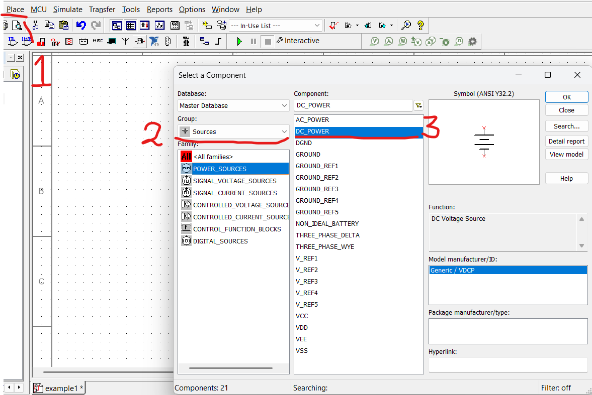

В этом окне можно переключать группы компонентов, нам пока понадобяться только 
`Sources` для источника напряжения и `Basic` для сопротивлений, ёмкостей, 
индуктивностей.

Перенесём на схему все нужные элементы и получим такой рисунок.

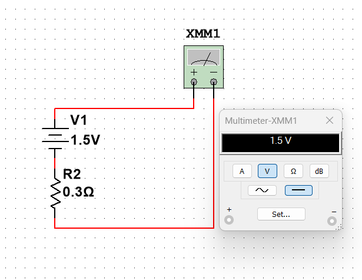

Чтобы открыть показания мультиметра `XMM1` на него надо два раза щелкнуть.

Файл со схемой будет вместе с отчетом [здесь](schemes/example1.ms14).

Элемент питания АА (или просто пальчиковая батарейка) выглядит так:

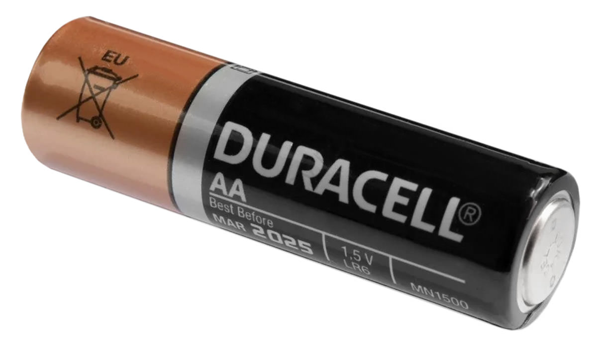

Мультиметр выглядит примерно таким образом:

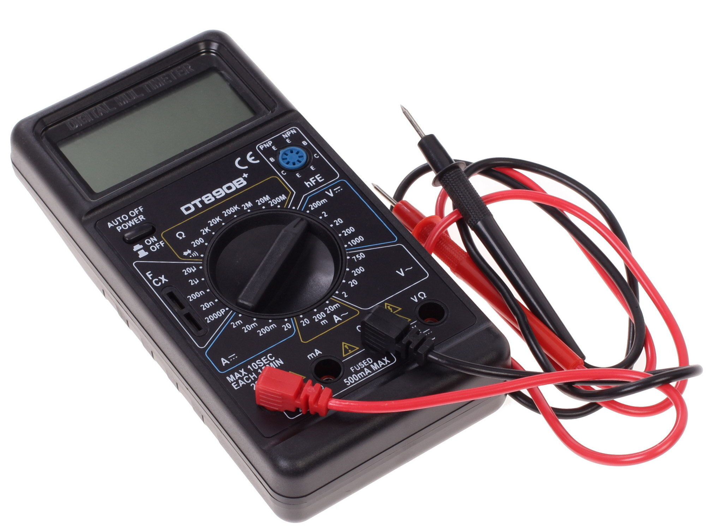

Теперь соединим последовательно восемь таких элементов и получим такой рисунок.

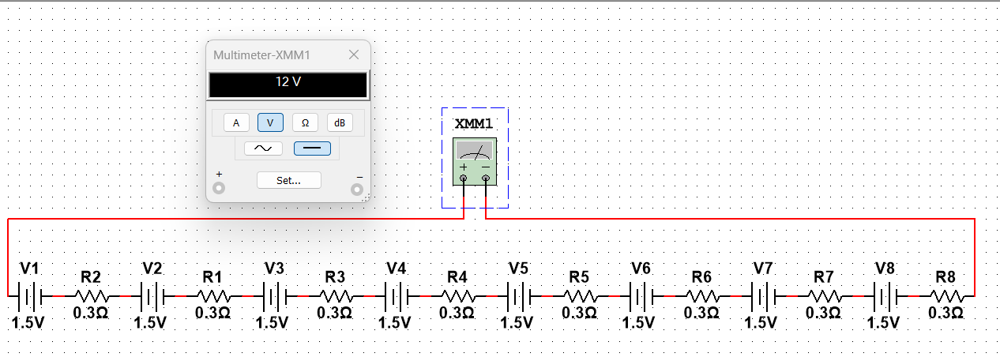

А почему когда мы соединяем их последовательно делаем это от **+** одного 
элемента к **-** другого. Что будет если соединить их наоборот?

Давайте рассмотрим.

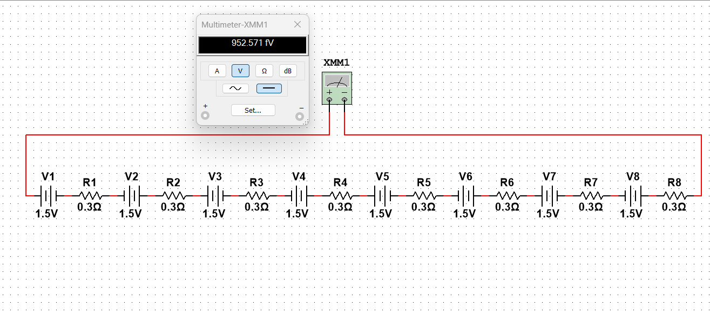

Теперь вместо 12 В мы получаем порядок 1000 фемтовольт, это:
$$1000\space фВ = 1000\cdot 10^{-15}\space В$$

Такое значение можно условно считать за ноль. То есть напряжение отсутствует.

Это очень маленькая величина. Почему так происходит? Что влияет на суммарное 
напряжение? Это является следствием того, что соединенные таким образом 
источники работают "навстречу" друг другу. То есть каждое из них пытается 
создать в цепи напряжение, обратное тому которое создает соседний элемент. 
Суммарное напряжение тогда:
$$U = \Sigma\space U_1 - U_2 + U_3 - U_4 ... - U_8$$
$$U = \Sigma\space +1,5В-1,5В+1,5В-1,5В...-1,5В = 0\space В$$

Существует такое правило сложения источников напряжения - когда мы складываем 
их напряжение - складываем алгебраически, то есть учитывая направление 
**+** и **-** со знаком в сумме.

Для удобства `NI Multisim` предоставляет возможность перенести эту схему 
в подсхему или в виде **иерархического блока**.

Добавим через меню `Place`->`New Hierarchical Block`. Зададим один вход (плюс) 
и выход (минус) этой батареи. Даём название этому блоку. Дальше нажимаем по 
нему и переходу в редактор подсхемы. Переносим в подсхему всё, что мы сделали 
и подкчлюаем плюс, например к левому входу а минус к правому.

Теперь у нас готова батарея из восьми элементов питания АА.

На рисунке ниже схема составленного иерархического блока.

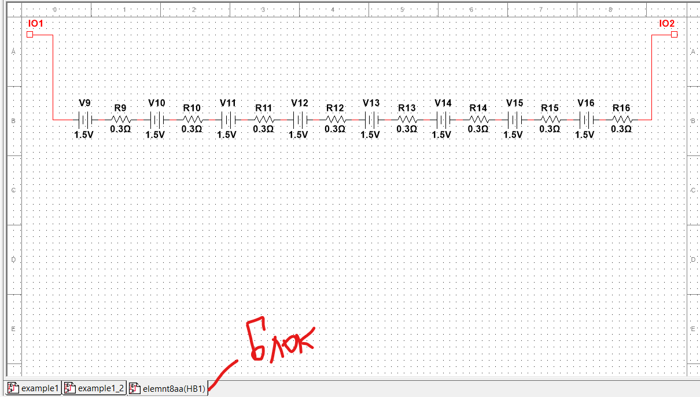

Тогда наша схема теперь стала выглядить следующим образом.

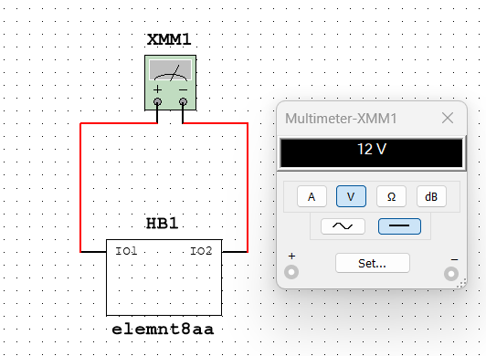

Как мы видим мы получаем ожидаемое напряжение 12 вольт из восьми элементов 
питания АА.

В качестве практического задания можно решить вот такую задачку.

**Задача 1.**   
Создать схему в `NI Multisim` - эквивалентную батарее, состоящей из 
никель-кадмиевых элементов питания ААА, обеспечивающей выход напряжения 
5 вольт. 

Некоторые вспомогательные источники для решения задачки:
- [Элемент ААА, статья в википедии](https://ru.wikipedia.org/wiki/%D0%AD%D0%BB%D0%B5%D0%BC%D0%B5%D0%BD%D1%82_AAA);
- [Спецификация на DURACELL MN2400](https://static.chipdip.ru/lib/827/DOC046827426.pdf)
- [В магазине ЧипДип](https://www.chipdip.ru/product/basic-lr03-mn2400)

Если возникли трудности с задачкой, то вот решение.

**Решение задачи 1**   
Согласно из статьи из википедии, никель-кадмиевые элементы питания по типу 
ААА выдают напряжение 1,25 вольт. Чтобы из них получить напряжение в 5 вольт, 
нужно соединить последовательно четыре таких элемента.

Внутреннее сопротивление согласно спецификации возьмём равное 156 мОм (указан 
импеданс на 1 кГц).

Соберём эквивалентную схему для одного такого элемента питания, потом соединим 
их последовательно. Получим следующую схему:

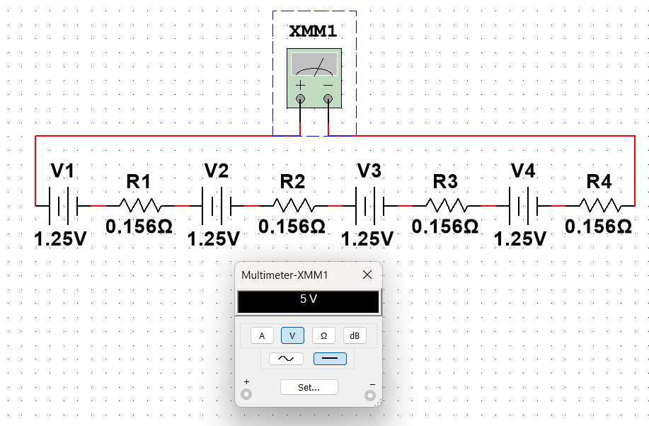

## Сравнение АКБ и батареи
Вернёмся теперь к примеру по заведению стартера машины с АКБ и батареек AA.

Для этого нам необходимо добавить на схеме аналогично источник постоянного 
напряжения АКБ и его внутреннее сопротивление.

Автомобильный АКБ выглядит так:   

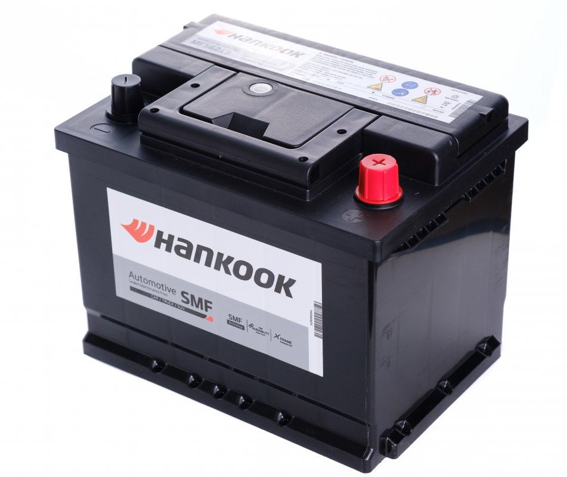

Далее подключим на АКБ и батарею нагрузки. Под этим понимается замыкание цепи 
(плюса и минуса источника) некоторым сопротивлением, чтобы пошёл 
электрический ток.

Для того чтобы правильно их сравнить - эксперимент следует проводить при 
прочих равных, то есть это сопротивление должно быть одинаковым в обеих 
ситуациях. 

Примем сопротивление обмотки стартера условно равным 0.1 Ом. Это число и будет 
выступать в качестве нагрузки.

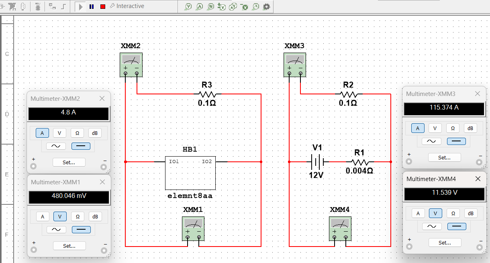

Сравнивать будем протекающий ток через стартер. Для этого на схему добавим 
мультиметр - последовательно в цепь, в режиме амперметра. Как мы видим значение 
**силы тока** сильно отличается.  
Сопоставим эти два числа:

$$\frac{115.374\spaceА}{4.5\spaceА} = 26$$

В 26 раз **сила тока** создаваемого с АКБ превышает с батареи из элементов АА. 
Это подтверждает сказанное ранее.

Кроме этого можно заметить, что показания вольтметра на каждом из источников 
перестало быть равным 12 вольт. Это связано с тем, что сопротивление нагрузки 
сопоставимо с внутренним сопротивлением источников. При этом, протекающий ток, 
в такой цепи, по обоим этим сопротивлениям будет одинаковым. 

Значит по `закону Ома` падение напряжения на внутреннем сопротивлении будет 
сопоставимо с падением напряжения (или просто напряжением) на нагрузке. Это и 
будет значить то, что источник питания (в данном случае батарея) не может 
обеспечить нагрузку без такого вот "проседания" напряжения. При этом ток на 
внутреннем сопротивлении будет переходить на внутренние процессы, протекающие 
в источнике (в основном химические или тепловые, то есть нагрев)

Давайте проведём небольшой расчёт цепи с АКБ по `закону Ома`. `Закон Ома` 
связыавает в уравнение три основные физические величины для электрических 
цепей - **сила электрического тока**, **сопротивления** проводника этого тока 
и **электрического напряжения**, приложенному к этому проводнику. 
Электрическое напряжение в контексте источника именуеют 
**ЭДС - электродвижущей силы**.

Само уравнение `Закон Ома` в общем виде:
$$I = \frac{U}{R}$$

Смысл уравнения состоит в том, что если мы приложим напряжение $U$ к 
сопротивлению $R$, то через это сопротивление потёчет ток равный $I$.

В нашем случае, поскольку мы учитываем внутреннее сопротивление источников нам 
следует немного поправить уравнение, добавив туда внутренне сопротивление. 
Тогда она будет выглядить так:
$$I = \frac{U}{R+r}$$

Где r - это внутреннее сопротивление источника.

Тогда это будет `закон Ома для полной цепи`.

Исходя из этих уравнений, можно представить такую форму `закона Ома`, которая 
бы учитывала сопротивление каждого элемента цепи:

$$I\cdot R = I_1\cdot R_1 + I_2\cdot R_2 + ... + I_n \cdot R_n$$

Где $I$ - это полный ток цепи, R - это полное сопротивление цепи. То есть если 
простыми словами, это и есть суммарный ток и сопротивление всей цепи. 
А $R_1$, $R_2$, ... $R_n$ - это сопротивления отдельных её элементов (участков 
или компонентов). При этом $I_1$, $I_2$, ... $I_n$ - это токи протекающие через 
эти элементы.

Но если исходить из начальной формулы:
$$I = \frac{U}{R}$$ 
то тогда напряжение можно выразить так
$$U = I \cdot R$$

И мы напишем по-другому:
$$U = U_1 + U_2 + U_3 + ... + U_n$$

То есть напряжение (разность потенциалов между плюсом и минусом) равна сумме 
падений напряжений на каждом участке цепи.

Теперь проведём расчёт для нашего примера согласно этим формулам.   
Напряжение источника:
$$U = 12\spaceВ$$
Полный ток цепи по `Закону Ома`:
$$I = \frac{U}{R+r}$$
Подставим значения для автомобильной АКБ:
$$I = \frac{12\spaceВ}{0,1\spaceОм + 0,004\space Ом}$$
Посчитаем:
$$I = 115,385\spaceА$$

Как мы видим - получаем точно такое же значение, что и в `NI Multisim` с 
точностью до второго знака после запятой.

Погрешность может быть связана с тем, что в `NI Multisim` для измерительных 
приборов, а именно в данной ситуации для амперметра - можно указывать их 
собственные характеристики, такие как сопротивление и прочие. Ясно, что 
**сопротивление амперметра** будет влиять на полный ток цепи.

Давайте учтём теперь сопротивление амперметра и снова найдем полный ток цепи. 
Сопротивление амперметра было задано по умолчанию равное 10 мкОм (микро Ом это 
миллионная доля Ом)

$$I = \frac{U}{R+r_{вн}+r_{ам}}$$

$$I = \frac{12\spaceВ}{0,1\spaceОм+0,004\spaceОм+0,00001\spaceОм}$$

$$I = 115,374\spaceА$$

Как мы теперь видим расчёт сходится с результатами симуляции в `NI Multisim`.

## Заряка АКБ в `NI Multisim`
Давайте теперь просимулируем зарядку автомобильной АКБ в `NI Multisim`. Для 
того чтобы симулировать поведение батарей такие компоненты как конденсаторы 
(емоксти) нам не подойдут в силу того, что аккумуляторы работают на химических 
принципах и не накапливают электрический заряд как это делают конденсаторы. 
Вместо этого они накапливают химическую энергию. Или если так можно сказать 
накапливают потенциал для химической реакции (как правило обратимой), создающей 
разность электрического потенциала - то есть напряжения.

Вместо этого мы будем использовать такой компонент как `NON_IDEAL_BATTERY`. Она 
находится в группе компонентов `Source` в семействе `POWER_SOURCES`.

В качестве параметров этому компоненты мы задаём:
- напряжение этой батареи в вольтах $В$;
- ёмкость батареи в $А\cdotч$
- внутреннее сопротилвние в $Ом$.

Если поместить на схему компонент `NON_IDEAL_BATTERY`, то он по умолчанию не 
будет иметь заряда. Это можно увидеть подключив к нему **вольтметр** - он 
покажет **напряжение** равное нулю.

Поэтому нам необходимо его зарядить. Чтобы это сделать - необходимо на схеме 
расположить источник. Но мы будем выбирать не абстрактный идеализированный 
источник напряжения, а попробуем подобрать аналог из реального мира. Для этого 
мы можем пойти разными путями, которые рассмотрим далее.

### Зарядка АКБ через лабораторный источник питания
Самый простой способ (в рамках исследования) - это использовать лабораторные 
источники питания. Они позволяют настраивать произвольное выходное напряжение, 
задавать ограничение выходного тока и соответственно имеют защиту от перепадов 
в сети и так далее. Кроме того, поскольку они лабораторные - они, как правило, 
имеют выоскую точность и стабильность устанавливаемых значений **напряжения**.

Напряжение, которое мы будем подавать на АКБ для его заряда должно быть чуть 
больше его номинального напряжения. Сейчас попробуем объяснить почему это так.

Во-первых при разряде аккумуляторов, их выходное напряжение падает. Для 
свинцово-кислотных АКБ это связано с химической окислительно-восстановительной 
реакцией (ОВР). При этом падает концентрация электролита, что приводит к 
падению выходного напряжения. Для заряда аккумулятора нужно провести обратную 
химическую реакцию. Это достигается путем подачи напряжения на АКБ извне.

Для конкретики возьмем:
- емкость АКБ равной $40\spaceА\cdotч$
- внутреннее сопротивление $0,02\spaceОм$
- номинальное напряжение $12\spaceВ$

Тогда на лабораторном источнике питание необходимо обеспечить:
- выходное напряжение для заряда $12,5\space...\space12,7 \space В$
- приемлемый ток заряда (чтобы не долго заряжать)
- внутреннее сопротивление $0,1\spaceОм$
- не допустить перегрузку сети электропитания, возгораний и прочего.

Сам лабораторный источник питания выглядит примерно как показано на рисунке 
ниже.

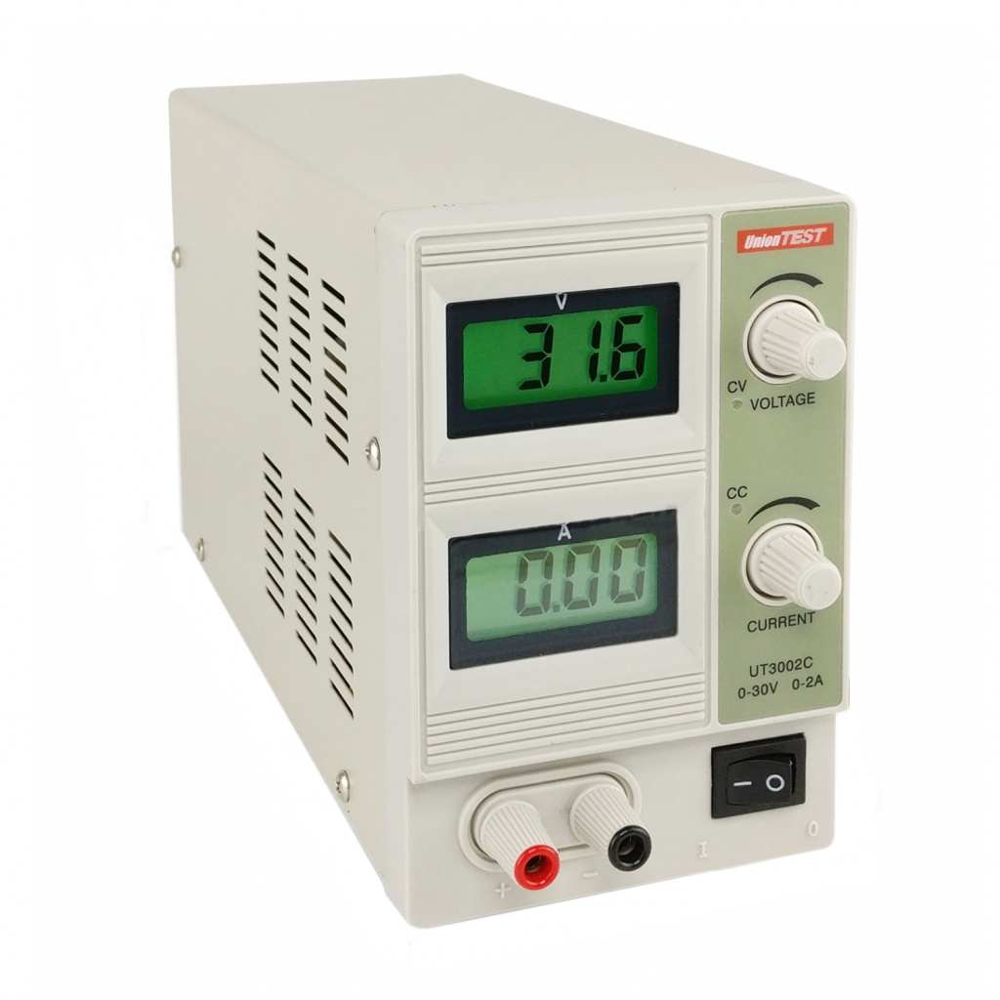

Расположим на схеме АКБ и источник питания (будем называть его лабораторным). 
Соединим их плюс к плюсу, минус к минусу.

Для контроля напряжений и токов расставим **вольтметры** и **амперметры**.

Также в источнике питания расположим **реле** (или просто переключатель, 
ВКЛ./ВЫКЛ.). Также для удобства добавим разметку - обведём источник питания 
в прямоугольник и подпишем.

Схема без подключения представлена ниже.

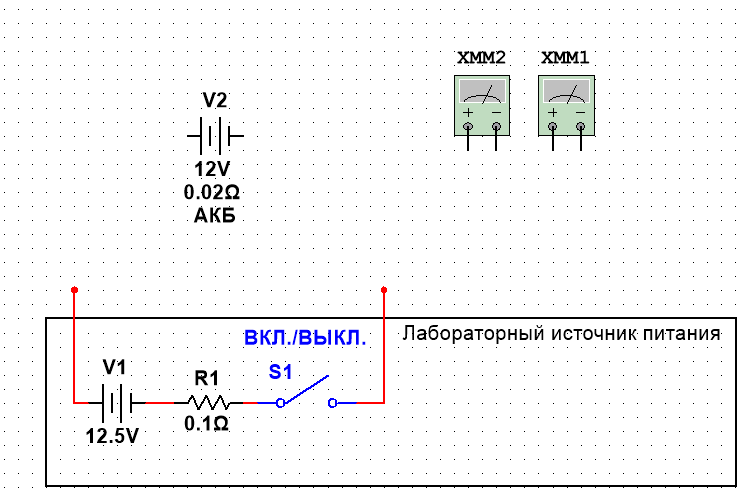

Подключим АКБ к источнику и подключим **вольметр** с **амперметром**.

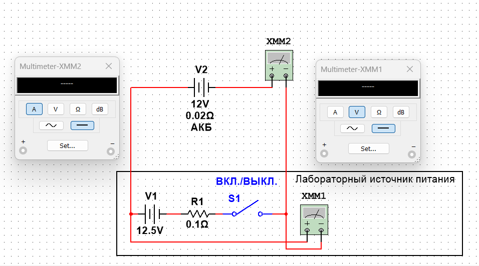

Теперь будем подавать напряжение так. Включим симуляцию и по клавише (по 
умолчаиню **space**) замкнём переключатель **ВКЛ./ВЫКЛ.**.

Полученный результат представлен ниже на анимированном GIF-изображении ниже. 

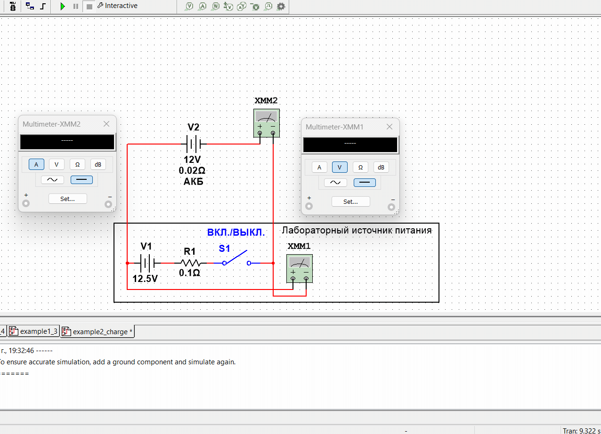

Что мы можем наблюдать при проведении такого рода симуляции?

1. Во-первых это то что, изначально (до замыкания) **амперметр** уже 
показывает некоторый ток равный $-88,8\spaceпА$. Это связано с тем, что 
**амперметр** имеет внутренне сопротивление и через цепь идёт мизерный ток.
2. Во-вторых до замыкания напряжение также не соответствует заданному 
$12,5\spaceВ$. Это опять же связано с **амперметром**.
3. После замыкания цепи возникает скачок тока и затем падает и стабилизируется 
на определенном значении$

Сначала скажем что АКБ заряжается после стабилизации током $2,702\spaceА$. При 
ёмкости, равной $40\spaceА\cdotч$ он зарядится через время равное емкости в 
ампер-часах, поделенной на ток в амперах.

$$t = \frac{40\spaceА\cdotч}{2,702\spaceА}$$

Рассчитаем:

$$t = 14,8\cdotч$$

То есть аккумулятор полностью зарядится через $15\cdotчасов$.

Конечно для симуляции в реальном времени (где время симулируемого процесса 
течет также как и в реальности) нас это не устраивает. Ждать 15 часов чтобы 
посмотреть на результат никуда не годится.

Да и вообще в целом компонент `NON_IDEAL_BATTERY` плохо годится для симуляции, 
поскольку в нём не задаётся номинальная емкость самого аккумулятора и начальный 
уровень заряда. Вместо этого можно по идее можно задавать напряжение 
подразряженного аккумулятора, например не $12\space В$ а поменьше. Но однако 
всё равно остается не понятным как работать и настраивать этот компонент.

Отметим что потребляемая мощность при этом будет составлять:
$$P = 12\space В \cdot 2,702\space А$$
$$P = 32,42\cdot Вт$$

А при скачке вначале мощность:
$$P = 12\space В \cdot 7\space А = 84 \cdot Вт$$

Это приемлемая мощность для сети. Сравним с потребляемой мощности бытовых 
приборов и домашней электроники:
- холодильники примерно $100...200 Вт$;
- компьютер $200...300 Вт$.

В довершение скажем, что скачок тока связан с переходным процессом, 
возникающим в результате замыкания цепи. А также может быть связан с тем, 
что заряжается сам аккумулятор.

### Зарядка через АКБ сеть 220 В
Чтобы заряжать АКБ через сеть $220\spaceВ$ необходимо обеспечить подключение 
через преобразователь. Поскольку для зарядки следует подавать $12,5\space В$. 
Если подать все $220\space В$ это может привести к трагическим последствиям. 
В автомобильном АКБ от такого напряжения будет проходить ток, приводящий к 
закипанию кислоты и возможно приведет к взрыву совместно с замыканиями цепи 
электропроводки и всего что останется от него.

Для того чтобы симулировать сеть 220 В, а также сделать зарядное устройство 
потребуются больше знаний и поэтому мы вернемся к этому вопросу позднее.

# Исследование сети электропитания 220 В
Давайте теперь рассмотрим стандартную сеть электропитания в 220 В/60 Гц. В 
ней как известно **переменное напряжение**, то есть если подключить к ней 
**вольтметр** и успевать следить за его значениями - то мы увидим как эти 
"220 вольт" всё время меняются. 

В сети 220 В - **напряжение** меняется от значения -310 до +310 В с частотой 
60 герц. Это значит через каждые 17 миллисекунд это **напряжение** успевает 
вернуться в исходное значение. Когда мы говорим про 220 В мы имеем ввиду 
**действующее значение** (или среднеквадратическое). Это связано с тем, что 
если бы подключили к сети электродвигатель или нагревательный прибор - мы бы 
получили тот же самый эффект и при подаче на него **постоянного напряжения** 
в 220 В. Это относится к производимой током работе (работе всмысле как 
физической величины). 

Внутренне сопротивление в розекте в сети 220 В может варьироваться от 
$0,1 ...  5\spaceОм$. Конечно это будет зависить от конкретной розетки и ёё 
состояния.

В качестве розетки на схеме в `NI Multisim` мы будем устанавливать источник 
переменного напряжения `AC_Power` и зададим там значения:
- Voltage (RMS) - это среднеквадратическое, **действующее значение** 
напряжения, будем устанавливать равным $220\spaceВ$.
- Frequency (F) - это частота с которой напряжение "скачет" в сети, установим 
равным $60\spaceГц$.

Вместе с самим `AC_Power` последовательно установим внутреннее сопротивление, 
допустим $1\spaceОм$. 

Получим такую картинку:

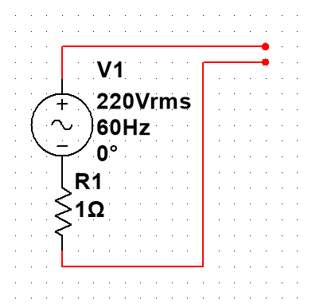

Также следует добавить заземление, будет выглядить так:

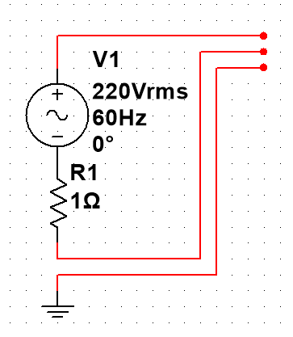

Сама розетка в реальности выглядит так:

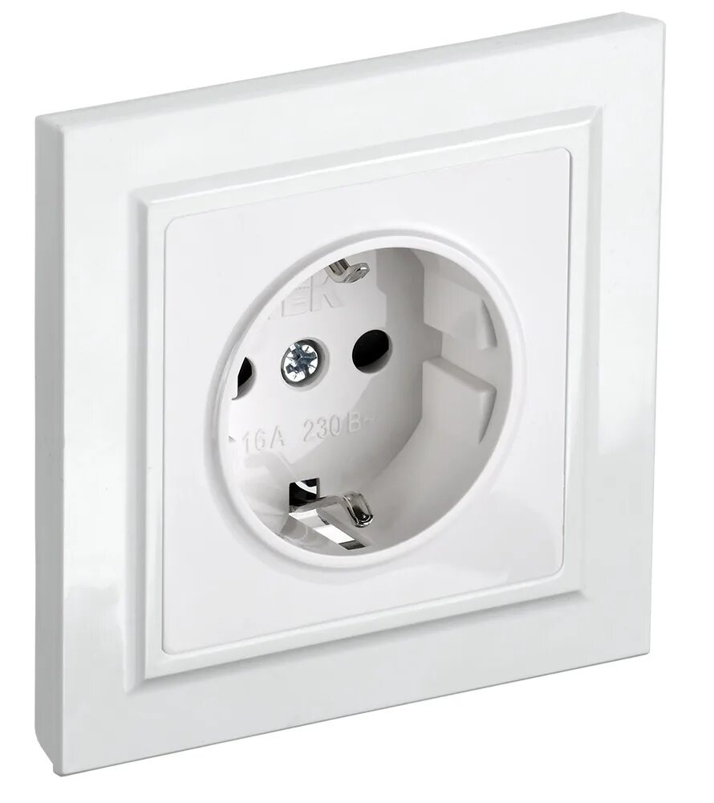

Как видим у неё есть два контактных отверстия, соответствующих как раз **+** и 
**-** источника на схеме и контактные поджимные пластинки, которые являются заземлением.

Попробуем в `NI Multisim` посмотреть напряжение сети через **мультиметр** в 
режиме **вольтметра**.

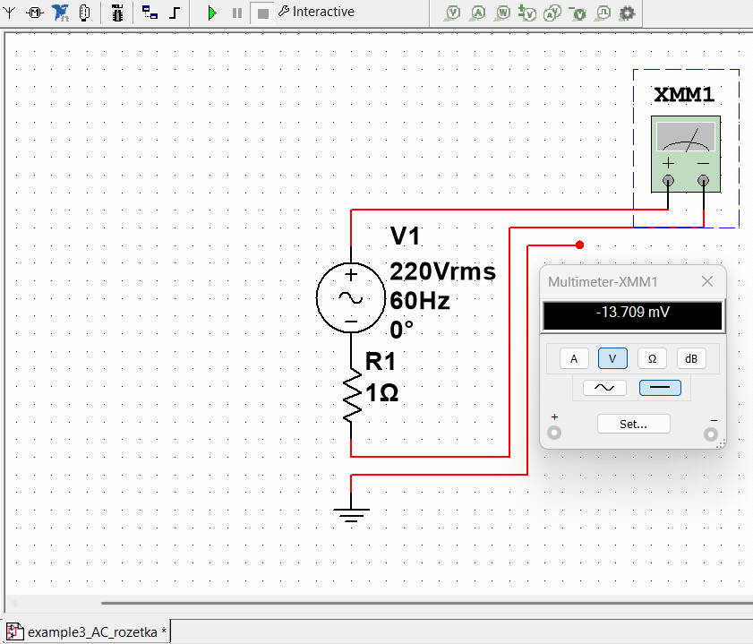

Когда мы смотрим на **вольметре** постоянное напряжение - мы фиксируем всего 
где-то от $-13\space... +13\space мВ$. При измерении переменного напряжения мы 
как раз получаем искомые $220\space В$.

Давайте теперь нашу розетку поместим в отдельный блок, чтобы она занимала 
меньше места на схеме.

Теперь наша схема будет выглядить так:

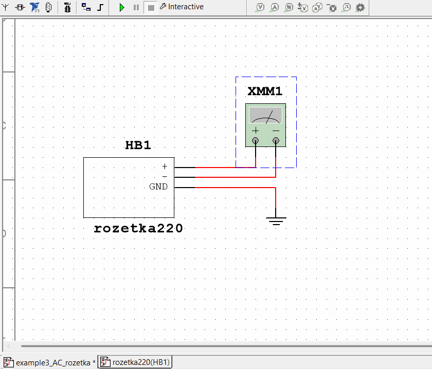

Можно изменить представление созданного **иерархического блока** нашей розетки, 
кликнув по мней правой кнопкой мыши и в контекстном меню 
`Edit Symbol/Title Block`. В загруженном окне можно отредактировать 
условно-графическое изображение нашей розетке на схеме.

Видоизменив розетку и подключим лампочку. Лампочку можно найти в группе 
`Indicators`->`VIRUTAL_LAMP`  Теперь посмотрим как лампочка загорается.

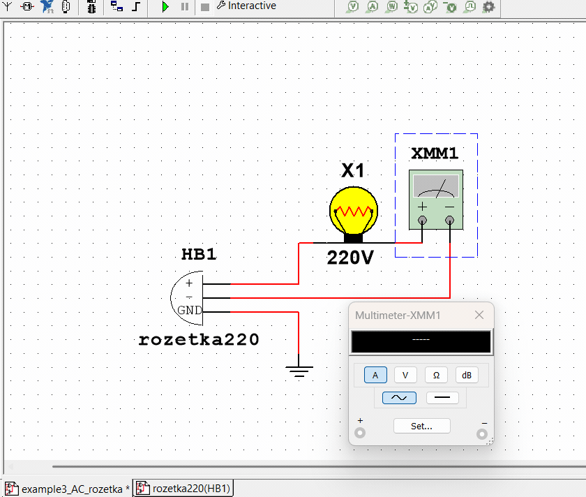

Как мы видим из анимированного изображения выше, лампочка когда мультиметр 
находится в режиме **амперметра**, а когда в режиме **вольтметра** - гаснет. 
Это потому, что **вольтметр** ставится параллельно цепи и через него не 
проходит ток. **Амперметр** же ставится последовательно и пропускает, 
измеряемый им ток.

Электрический ток протекающий в цепи мы измерили на **амперметре**:
$$905.32\spaceмА\eqsim1\space А$$

Значит потребляемая мощность:
$$1\space А\cdot220\spaceВ = 220\space Вт$$

Это и соответствует, заданному свойству лампочки:
- Maximum rated power (Watts) = 200 Вт

Давайте теперь подключим нагрузку в сеть (в розетку). В качестве такой - 
схематически достаточно использовать сопротивление. Это значит что под 
**сопротивлением** может быть любое устройство, любой **потребитель**. 

Также для исследования - поставим изменяемое вручную сопротивление, чтобы 
смотреть как изменение нагрузки влияет на потребляемый ток.

Сначала попробуем нагрузки в районе $1 кОм$.

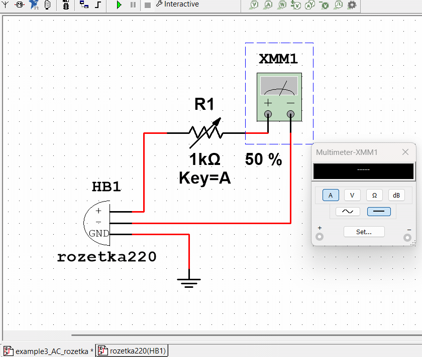

Как мы видим из анимированного изображения выше, при уменьшении сопротивления 
нагрузки - ток потребления вырастает.

Как мы уже знаем, чем выше ток потребления, тем и больше потребляемая 
мощность. Посчитаем мощность потребления при нагрузке сети на нагрузку 
$1\space кОм$:
$$P = 220\space В \cdot 439,12\spaceмА$$
$$P = 96,6\space Вт$$

Куда будет деваться потребляемая энергия? Электрический ток, при прохождении 
резистора будет его нагревать. Это связано с тем, что электрический ток 
представляет из себя движение заряда (электронов) внутри проводящего тела. 
Когда заряды движутся - они задевают молекулы вещества проводящего тела. Далее 
эти молекулы из-за столкновений начинают колебаться. Колебания же молекул, из 
которого тело состоит - это и есть и есть нагревание, повышение температуры 
тела.

Описывает это являение `Закон Джоуля-Ленца`. Согласно этому закону, количество 
теплоты и электрические характеристики связаны в уравнение:
$$Q = \frac{U^2t}{R}=I\cdot U\cdot t$$

Где $Q$ - это количество выдялемой теплоты в джоулях $Дж$. 

Произведение электрического тока и напряжения равно мощности, как мы уже 
считали ранее, тогда:
$$Q = P\cdot t$$

Найдем какое количество теплоты будет выделено на резисторе $1\space кОм$, 
воткнутым в розетку в течение 30 секунд:
$$Q = 96,6\space Вт\cdot 30\space с = 2898\space Дж$$

Но полученное значение нам пока ничего не говорит. Давайте определим насколько 
сильно должен раскалиться резистор. 

## Немного про резисторы

Пусть наш резистор - это 
[углеродистый резистор CF-100](https://www.chipdip.ru/product/cf-100-s1-4-1w-1-kom-5). 
Он выглядит таким образом:

Найдем в справочниках значение удельной теплоемкости углерода:
$$c = 710 \frac{Дж}{кг\cdot C}$$

Масса такого резистора равна
$$m = 0,2\spaceг$$

Тогда температура:
$$\Delta T = \frac{Q}{m\cdot c}$$
$$\Delta T = \frac{2898\space Дж}{0,2\space г \cdot 710\space \frac{Дж}{кг\space ^\circ C}}$$

$$\Delta T = 20\space408\space ^\circ C$$

Как мы видим температура резистора изменится на 20 тысяч градусов. Иными 
словами он перегорит.

Если взять время, которое он будет находиться в розетке всего 1 секунду, это 
в тридцать раз меньше полученного значения:
$$\Delta T = 680,26\space ^\circ C$$

Этого также достаточно для того, чтобы резистор мгновенно перегорел.

А если мы к примеру возьмём какой-нибудь не **маломощный** резистор, а 
наоборот **силовой**. Пусть это будет 
[АН-100](https://www.chipdip.ru/product/ah-100-100w-1-kom-5), 
расчитанный на 100 Вт.

Сам резистор выглядит так:

Это так называемый `Aluminium Housed Resistors`. Сама обмотка резистора из 
нихрома помещена в керамическую оболочку. Она капсулируется в керамическую 
оболочку с помощью термостойкого компаунда и помещается в алюминиевый корпус. 
Сам корпус выполнен как **радиатор**, то есть он конструктивно имеет наибольшую 
ребристую поверхность - для лучшего рассеяния тепла в окружающую среду. 

Никхром это сплав никеля и хрома. Давайте найдем в справочнике удельную 
теплоемкость нихрома.
$$c = 450 \frac{Дж}{кг\cdot К}$$

Масса такого резистора:
$$m = 115\space г$$

Значит в течении секунды он нагреется на:
$$\Delta T = \frac{2898\space Дж}{115\space г \cdot 450 \frac{Дж}{кг\cdot К}}$$

$$\Delta T = 56\space ^\circ K$$

Ну переводя на градусы цельсия это будет такая же дельта:
$$\Delta T = 56\space ^\circ C$$

И это в расчёте на $30\space секунд$ работы, и без учёта рассеивания этого 
тепла в окружающую среду.

За одну секунду он нагреется на:
$$\Delta T = 1,87\space ^\circ C$$

То есть, если прибавить комантуню температуру (его начальную температуру) - 
получим:
$$\Delta T = 26,87 ^\circ C$$

Проведённые выше расчеты показывает - что изображаемое на электрической схеме 
необходимо только для того, чтобы установить принципиальные **электрические** 
характеристики. Важно учитывать реальные физические свойства используемых 
компонентов, если уже необходимо реализовывать схему. 

Существует различие между тем, как изображается резистор на принципиальных 
электрических схемах. Принятые у нас обозначения такие:

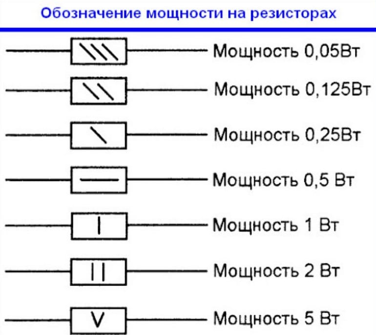

Условно-графическое изображение сопротивления в виде прямоугольника является 
международно принятым (стандарт IEC 60617). А вот его изображение в таком виде:

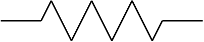

Принято американскими стандартами ANSI Y32.2.

По умолчанию в программе `NI Multisim` мы имеем дело с обозначениями на схеме, 
принятыми американским стандартом. Давайте изменим это в настройках меню 
`Options`->`Global Options`->`Components`->`Symbol Standard` и изменим его на 
`IEC 60617`.

Теперь вернёмся к нашей розетки и воткнём туда резистор с большим 
сопротивлением. Пусть он будет порядка МОм. 

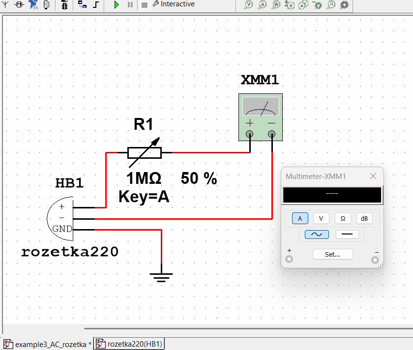

Как мы видим, ток потребления теперь стал порядка микроампер. А потребляемая 
мощность тогда:
$$P = 440\space мкА\cdot 220\space В$$
$$P = 0,1\space Вт$$

Это десятая доля ватта. Тепло которые будет выделено за одну секунду:
$$Q = P\cdot t = 0,1\space Дж$$

Сравнительно с предыдущими расчетами следует, что такой резистор, даже если он 
будет **маломощным**, но обладать таким сопротивлением не должен перегореть. 
Но его температура поднимется за секунду на $7\space градусов\space цельсия$. 

За 30 секунд на $210\space ^\circ C$. 

# Знакомство с осциллографом, AC/DC, 220 В
Давайте теперь рассмотрим напряжение в сети 220 В поподробнее. Существует 
такой измерительный прибор, который называется **осциллограф**. Чем он лучше 
**вольтметра**? Дело в том, что **вольтметр** позволяет нам измерить **напряжение** только в один определенный момент времени - когда мы на него смотрим и фиксируем значение. Но как быть со значениями напряжения, если они меняются быстрее чем мы успеваем за ними уследить?

Главная особенность в том, если так можно сказать, что **осциллограф** он также как и **вольтметр** фиксирует значения напряжения, но делает это постоянно и запоминает все показание за некоторый промежуток времени. То есть на **вольметре** показания будут меняться всё время, а на осциллографе мы будем иметь дело со всеми показаниями, записанными **вольметром** за промежуток времени.

Обычно эти показания напряжения на осциллографе представляются в виде графика.

Как это будет выглядеть в `NI Multlsim` сейчас посмотрим. Для этого перенесём справа измерительный прибор `Oscilloscope` на схему.

Два раза щёлкнем на него и перед нами появиться окно, которое похоже на переднюю приборную панель настоящего осциллографа.

Настроим его для измерения сетевого переменного напряжения:
- Channel A, Scale 200 V/Div (200 вольт на деление);
- Timebase, Scale 10 ms/Div (10 миллисекунд на деление);
- Channel A - AC

В результате получаем такую картину:

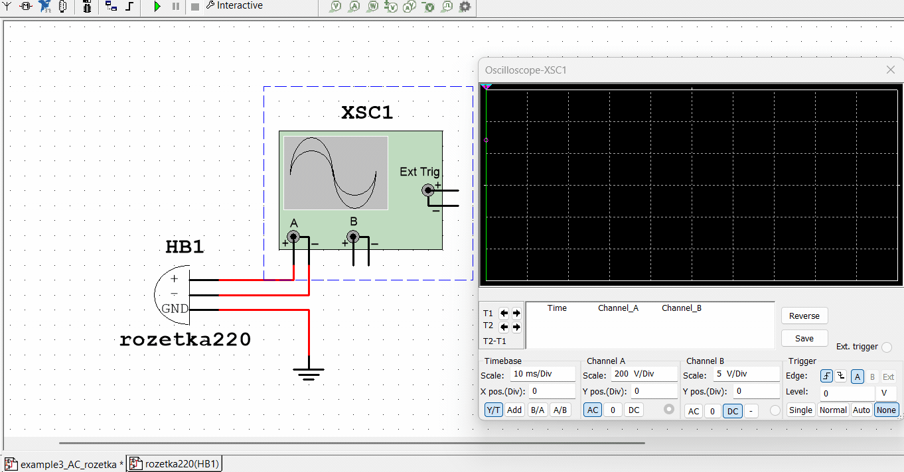

Как мы видим на виртуальной приборной панели осциллографа отображен график напряжения сети. На всем экране отображены все значения напряжения, зафиксированные осциллографом в течении времени равном:
$$\Delta t \cdot 10 = 10\space мс \cdot 10 = 100\space мс$$

По горизонтали - 10 делений по 10 миллисекунд это 100 миллисекунд. Это значение называется **диапазон временной развёртки**.

По вертикали сама величина измеряемого напряжения.

Как мы видим по полученному на нашем осциллографе графике, сетевое напряжение имеет вид синуса. Значение напряжение в верхней границе, если считать по делениям составляет около 300 (одно деление плюс половина деления). В нижней -300 В соответственно.

Размах от верхней пиковой точки до нижний, 
$$V_{pp} = 300\space В - (-300\space В)= 600\space В$$

Где $V_{pp}$ - это принятое обозначение **peak to peak** (то есть от пика до пика).

# Диоды, AC/DC
Давайте теперь подумаем что такое переменное напряжение в сети? Как мы видим из графика на осциллографе - значение напряжение "пробегает" от нулевого до положительного, потом падает до нуля, снова падает и становится отрицательным.

Теперь представим что бы было с приборами, когда на них подается переменное напряжение вместо постоянного. Вместо того, чтобы ток по электрической цепи этого прибора шел в одном направлении - он будет все время меняться то в одну сторону, то в другую. А в один момент времени вообще переставать течь. 

Такое "скачущее" напряжение для большинства электрических приборов - выведет их из строя.

Как же решается эта проблема? Решение проблемы достигается путём преобразования этого **переменного напряжения** в **постоянное**. Для этого между оконечным потребителем в виде какого-нибудь электроприбора и самой сетью - ставится адаптер питания, или так называемый блок питания. Разница в названиях блок или адаптер из-за конструкции. Блок - это целая коробка, а адаптер должен быть поменьше.

Адаптер питания выглядит примерно так:

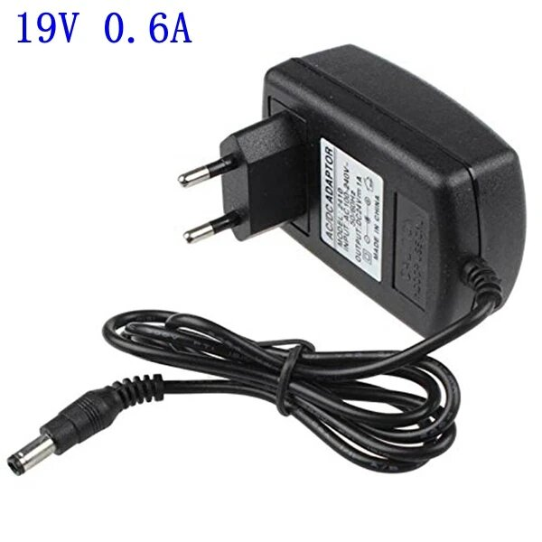

Блок питания так:

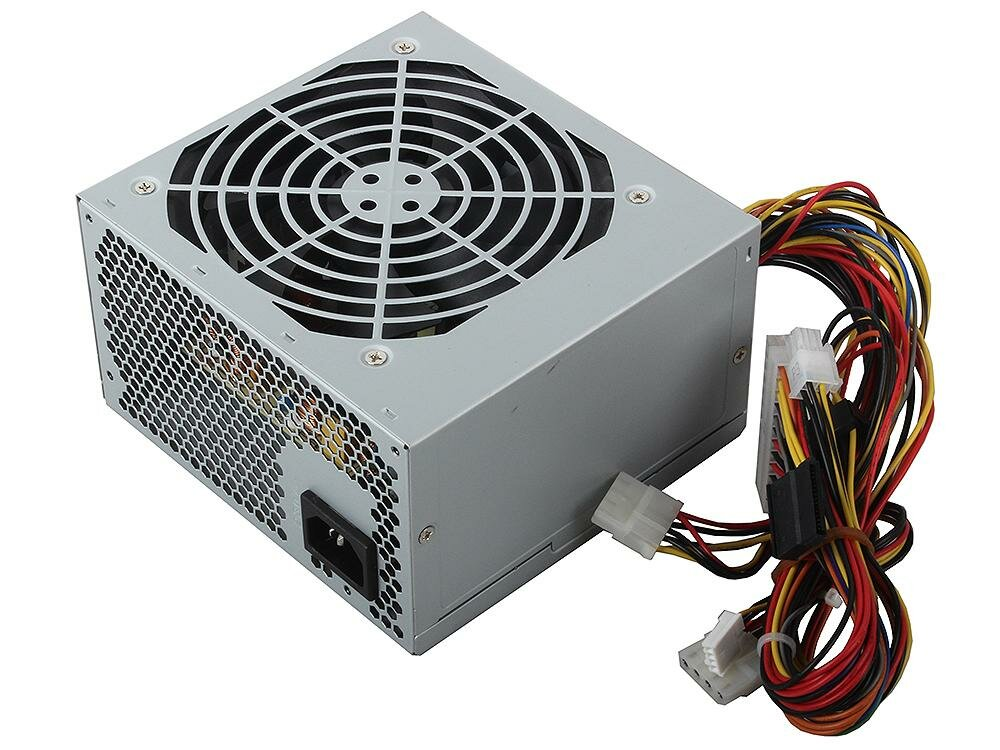

Как же в этих устройствах достигается преобразование переменного напряжения сети - в постоянное?

Для ответа на этот вопрос нам необходимо обратиться к другим радиокомпонентам. Существует такой радиокомпонент с подходящими свойствами - он называется **диод**.

**Диод** работает следующим образом. Он имеет два контакта, условно скажем левый и правый. Если мы подаем напряжение в левого на правый - то через него будет проходить ток. А если мы подаем напряжение наоборот с правого на левый - то ток идти не будет.

Такое свойство **диода** обеспечивается тем, что он обладает **переменным сопротивлением**. Его **сопротивление** зависит от того в каком направлении мы подаем на него **напряжение**, или если так можно сказать от полярности. 

При подаче на него напряжения в прямом направлении - мы получаем **диод** с малым сопротивлением. А это значит он будет **проводником**. 

Если в обратном - **диод** будет с большим сопротивлением и может выступать чем-то вроде **диэлектрика**. 

Давайте теперь добавим на схему **диод** и рассмотрим вышесказанное. Также добавим последовательно ему какое-нибудь незначительное сопротивление в качестве нагрузки.

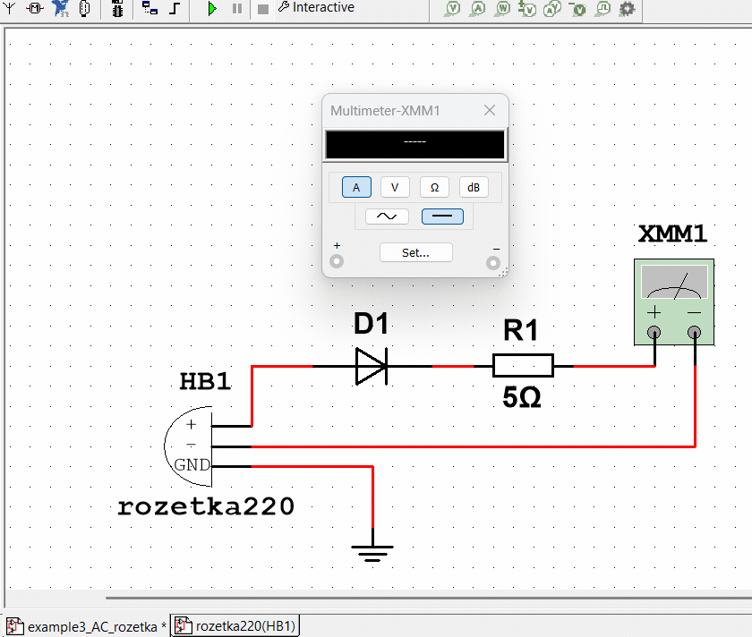

Как мы видим из анимированного изображения выше - при подключении диода в другом направлении меняется знак протекающего тока.

Это как раз и связано с тем, что диод перестал пропускать ток в одном из направлений.

Иногда `NI Multisim` будет выдавать ошибки связанные с симуляцией, можно запустить автоматическое их исправление (например он поменяет у себя численные методы для расчетов). Также для их исправления можно установить `Initial Conditions` (начальные условия) в `Analyses and Simulation` в `User-Defined` (опредляемые пользователем).

Но стало ли уже напряжение прямым? Давайте посмотрим это напряжение на резисторе, представляющим собой нагрузку. Смотреть будем на осциллографе.

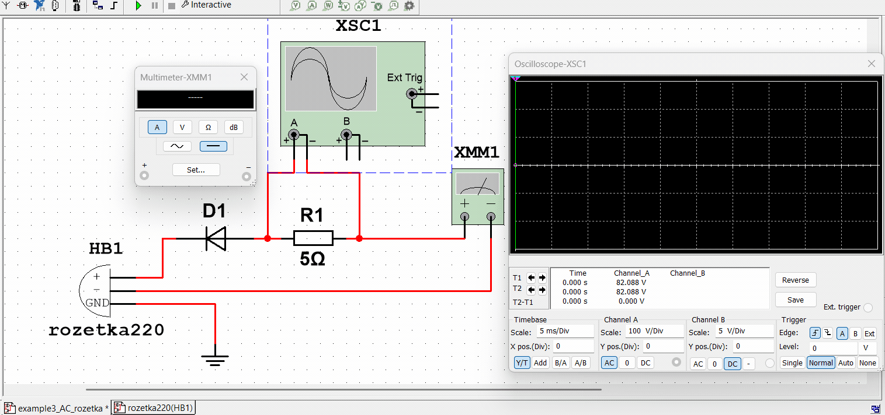

Как мы видим на осциллографе, диод "отбрасывает" одну из половинок синуса, представляющего собой переменное напряжение.

Из таких диодов обычно собирают схему, которая называется **диодный мост**. Выглядит она так:

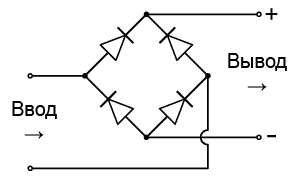

Красным и синим цветом представлены положительное и отрицательные напряжения идущие к **+** и **-** соответственно. Как это видно из рисунка, напряжение всегда будет поддерживаться постоянным на этих выводах и не пропадать.

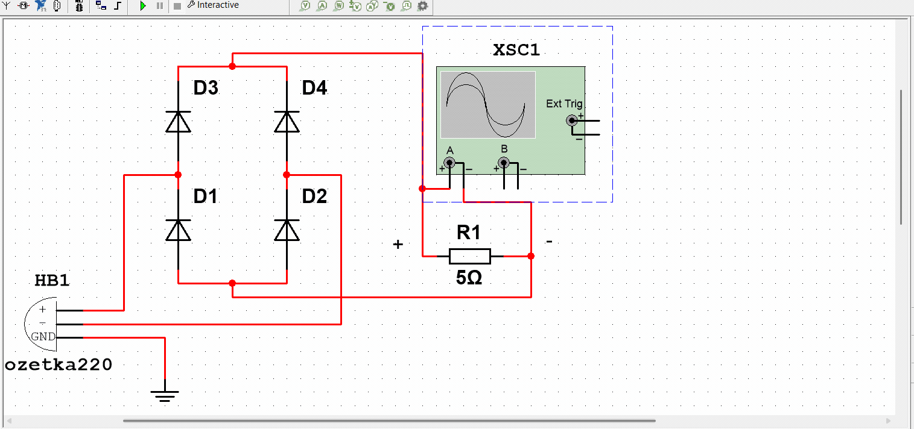

Обратим внимание, что теперь период переменного напряжения стал в два раза меньше.

Одну проблему с изменением направления тока решили - ток теперь течет в одну сторону, но он всё равно изменяется по величине от нуля до некоторого значения.

Чтобы решить эту вторую проблему - нужно поставить **сглаживающий фильтр**. Чтобы сгладить импульсы обычно ставят **электролитический конденсатор**. Он обладает достаточной емкостью, чтобы накопить "скачущий" заряд. Когда конденсатор подзарядится он будет поддерживать постоянное напряжение в пике.

Установим например конденсатор емкость $470\space мкФ$

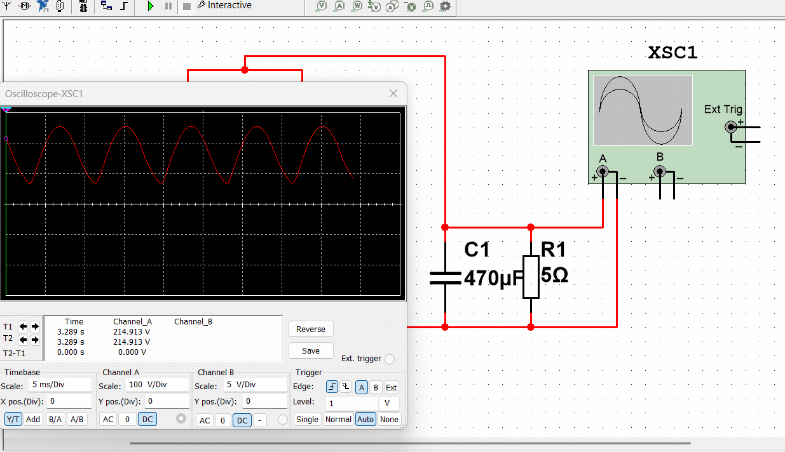

Как мы видим, теперь напряжение больше не падает до нуля. И сам синус немного сгладился.

Увеличим емкость конденсатора и посмотри что будет.

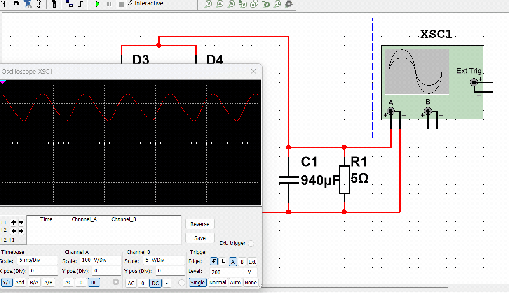

Теперь мы видим, что чем большей ёмкостью обладает конденсатор, тем он более способен запасти энергию и выровнить напряжение.

Давайте теперь посмотрим что будет, если увеличивать сопротивление. Для этого вместо нагрузки поставим переменное сопротивление скажем 10 Ом.

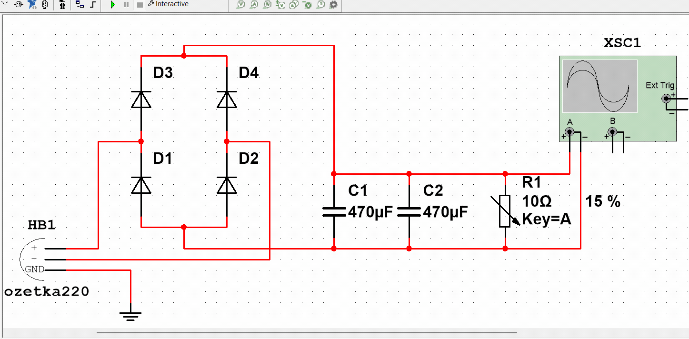

Какие выводы можно сделать из приведенного выше рисунка? Чем больше мы делаем сопротивление нагрузки - тем более сглаженным становится напряжение. Это может быть связано с тем, что при увеличении сопротивления - уменьшается потребляемый ток.

А раз потребляемый ток становиться меньше, то и медленнее разряжается конденсатор при "проседании" напряжения. 

А чем выше потребляемый ток, тем быстрее будет разряжаться конденсатор.

Следовательно - необходимо некоторое согласование нагрузки и сглаживающего фильтра.

Давайте оговоримся, что нагрузка будет тем больше, чем меньше будет сопротивление. Имеется ввиду что при меньшем сопротивлении - будет большее потребление тока.

Значит чем больше нагрузка, тем большей ёмкости нужен конденсатор для сглаживания сетевого напряжения.

В `NI Multisim` уже есть готовые диодные мосты, являющиеся аналогами некоторых диодных мостов от разных производителех.

# Индуктивность, гальваническая развязка
Теперь хотелось бы рассказать про такое явление называемое **гальваническая развязка**. Гальваническое, или другими словами токовой развязкой называют такой способ соединения цепей, при котором ток не идёт в цепь напрямую, а идёт опосредованно. Что это значит? Это значит что электрический ток будет поступать из сети электропитания (розетки) не напрямую, а через развязку.

Самая распространенная развязка - это развзяка на транформаторе. Устанавливаются две одинаковые катушки (катушки индуктивности), которые из себя представляют обычные катушки на которых наматывается, как правило, медная проволока. 

Внутри такой катушки может быть либо полость, либо вставляться магнитный стержень для регулирования её характеристик.

Сама такая катушка выглядит таким образом:

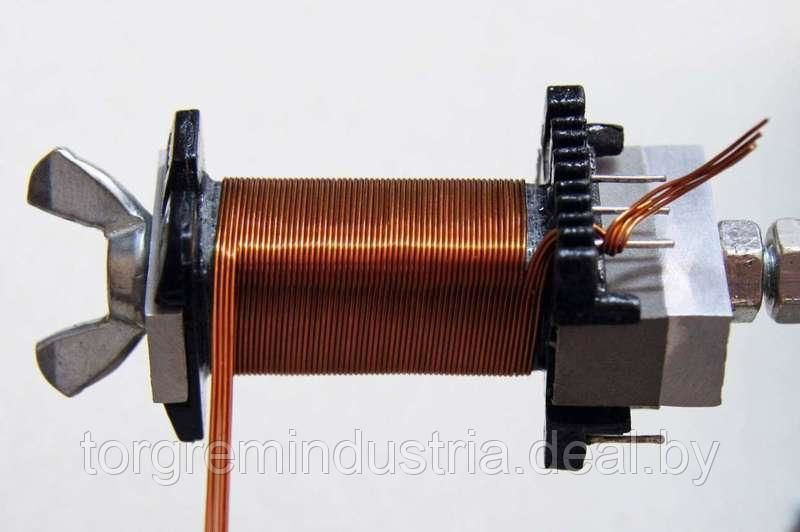

А трансформатор, состоящий из двух катушек примерно так:

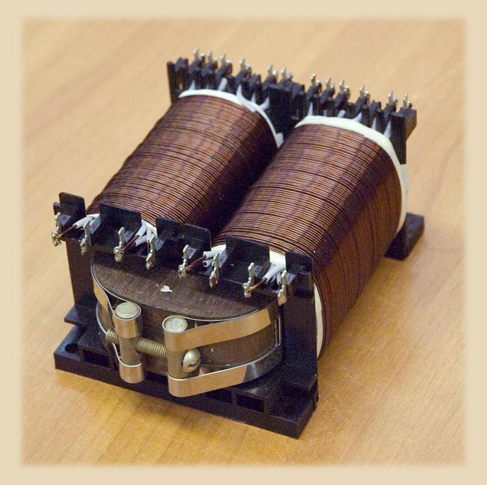

А зачем нужно делать такую развязку? В основном это необходимое требование электробезопасности. В случае замыканий в цепи - будет замыкаться только одна из сторон развязанных друг от друга цепей. Поэтому если человек замкнет собой цепь со вторичной обмотки - это не приведет к поражению током.

Добавим на нашу схему трансформатор 1:1 и получим:

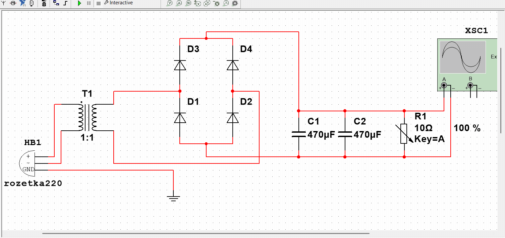

А почему когда мы так подключаем трансформатор не происходит замыкания в розетке? Вот таким вопросом я задался и поискав на него ответ, вот что могу сказать.

На самом деле через первичную обмотку (катушку) действительно из розетки как при коротком замыкании начинает идти переменный ток. Вернее сказать когда он только начинает течь и меняться - катушка запасает энергию в виде генерируемого магнитного поля. Возникаемое магнитное поле будет создавать обратное напряжение, или если правильно говорить обратную **ЭДС самоиндукции**. Эта **ЭДС самоиндукции** будет направлена против изменения тока. Под изменением поинмается то что ток, как и напряжение в сети переменные.

Давайте рассмотрим чуть подробнее это явление. Как мы знаем из физики, электричество и магнетизм тесно связаны. Электрические силы переходят в магнитные и наоборот. На этом принципе и построен электродвигатели и электрогенераторы. Такое явление **электромагнитной индукции** было установлено **Майклом Фарадеем** опытным путём.

**Майкл Фарадей** как раз установил его при работе с катушками. Если мы возьмём обычную катушку, на которую обмотан проводник, например в виде медной проволоки. Подключим эту катушку к **амперметру** для измерений. И когда мы будем помещать в катушку магнит, при его поступлении и возврате - на **амперметре** будет зафиксирован некоторый ток.

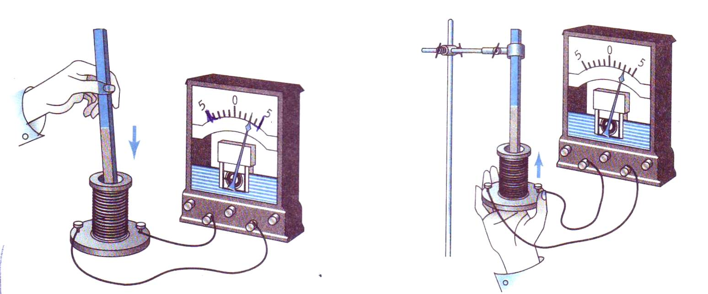

Это как раз связано с явлением **электромагнитной индукции**, когда переменное (из-за движения магнита) магнитное поле - создаёт в катушке **ЭДС индукции** и соответственно электрический ток.

Однако помещение магнита или его вынимание из катушки не единственный способ индуцировать **ЭДС** и ток. Из вышесказанного - можно предположить и обратное. Если катушка реагирует на магнитные явления, то и сама катушка в какой-то мере магнит. 

Действительно это так. Если через **катушку** пропускать **электрический ток**, то она станет **магнитом** и будет притягивать металлические предметы, другие магниты. 

В общем говоря, электрический ток или если быть точнее движущиеся **электрические заряды** - создают вокруг себя **магнитное поле**. 

Если **электрические заряды** движутся по кругу, то они создают поле поперек центра круга по которому они движутся.

Возвращаясь к катушке, которая подключается к сети 220 В.

Поскольку через неё идет не постоянный, а переменный ток. Вернее сказать начинает течь, возникнет явление **самоиндукции**. Катушка сгенерирует **магнитное поле**, противодействующее собственному возникновению. Значит когда магнитное поле накопиться достаточной мощности - в результате такой **самоиндукции**, при достаточной **индуктивности** катушки - ток будет полностью компенсироваться.

Однако если со вторичной обмотки будет потребитель (нагрузка), то ток перестанет компенсироваться. Теперь и в первичной и во вторичной обмотке потечёт электрический ток, равный потребляемому току.

На что похоже такое свойство индуктивности катушки? Когда через **индуктивность** протекает электрический ток - она стремиться его ослабить **самоиндукцией**. Но если сказать по-другому, препятствование протеканию электрического тока - это **сопротивление**.

Но, поскольку это сопротивление отличаеться по своей природе от электрического сопротивления материалов - оно называется по-другому. Оно называется **реактивное сопротивление**.

А обычное сопротивление материала называется **активное сопротивление**

Давайте рассмотрим катушку подключенную к источнику переменного напряжения.

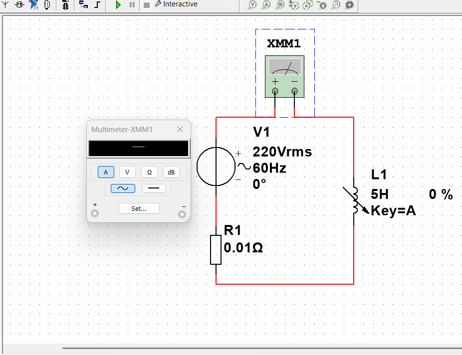

Как мы видим, при изменении индуктивности катушки в районе 5 генри - значение тока сильно меняется. Причём при отсутствии (0%) индуктивности будет короткое замыкание (КЗ) и ток $22\space кА$.

А если добавить 50% от 5 генри будет $116\space мА$

Это подтверждает всё вышесказанное.

Давайте измерим что происходит в цепях по две стороны гальванической развязки - с первичной в сети, и со вторичной на стороне потребителя.

Не забудем установить соответствующее таким катушкам нашего трансформатора значения индуктивности и сопротивление.

- **индуктивность** $1\space Гн$ (`Core`->`Non-ideal core`);
- **активное сопротивление** $10\space мОм$ (Resistance).

Заземлим наш участок **DC** и посмотрим что получается.

Как мы видим получаем более-менее стабильное **DC** напряжение. Уменьшим теперь нагрузку, увеличив сопротивление до порядка $300\space Ом$ и получим:

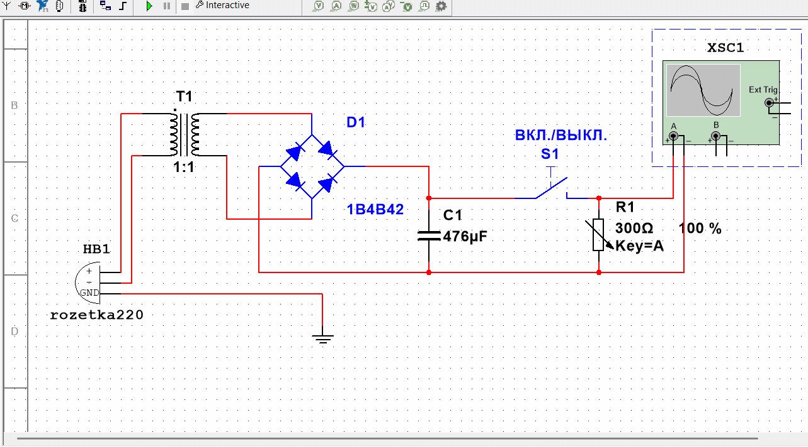

